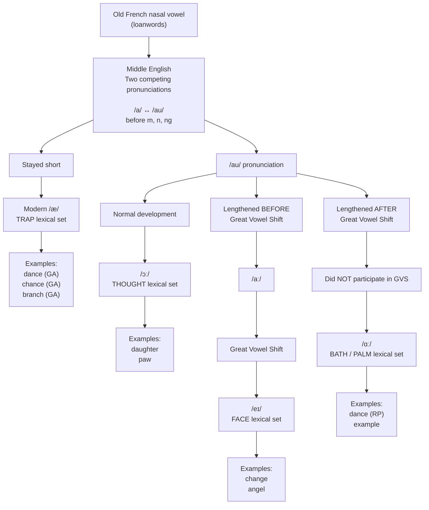

[[Pronouncing A]]

| Modern pronunciation | Lexical set | Example            |
| -------------------- | ----------- | ------------------ |
| /æ/                  | TRAP        | American **dance** |
| /ɑː/                 | BATH/PALM   | British **dance**  |
| /ɔː/                 | THOUGHT     | daughter, paw      |
| /eɪ/                 | FACE        | change, angel      |

### Graph showing Nasal sounds pronunciation before a 

**YOU JUST HAVE TO LEARN IT.  NO OTHER WAY AROUND IT.**

There was a class of Middle English words in which /au/ varied with /a/ before a [nasal](https://en.wikipedia.org/wiki/Nasal_consonant "Nasal consonant"). These are nearly all [loanwords](https://en.wikipedia.org/wiki/Loanword "Loanword") from [French](https://en.wikipedia.org/wiki/French_language "French language"), in which uncertainty about how to realize the [nasalization](https://en.wikipedia.org/wiki/Nasalization "Nasalization") of the French vowel resulted in two varying pronunciations in English. (One might compare the different ways in which modern French loanwords like _envelope_ are pronounced in contemporary varieties of English.)

Words with Middle English with the /au/ diphthong [generally developed](https://en.wikipedia.org/wiki/Phonological_history_of_English_low_back_vowels "Phonological history of English low back vowels") to `ɒː` in Early Modern English (e.g. _paw_, _daughter_). However, in some of the words with the /a ~ au/ alternation, especially short words in common use, the vowel instead developed into a long A. In words like _change_ and _angel_, this development preceded the [Great Vowel Shift](https://en.wikipedia.org/wiki/Great_Vowel_Shift "Great Vowel Shift"), and so the resulting long A followed the normal development to modern /eɪ/. In other cases, however, the long A appeared later, and thus did not undergo the Great Vowel Shift, but instead merged with the long A that had developed before /r/ and some fricatives (as described above). Thus words like _dance_ and _example_ have come to be pronounced (in Standard Southern British, although mostly not in General American) with the /ɑː/ vowel of _start_ and _bath_.

Words in this category may therefore have ended up with a variety of pronunciations in modern standard English: /æ/ (where the short A pronunciation survived), /ɑː/ (where the pronunciation with lengthened A was adopted), /ɔː/ (where the normal development of the AU diphthong was followed), and /eɪ/ (where the A was lengthened before the Great Vowel Shift). The table below shows the pronunciation of many of these words, classified according to the [lexical sets](https://en.wikipedia.org/wiki/Lexical_set "Lexical set") of John Wells: TRAP for /æ/, BATH for RP /ɑː/ vs. General American /æ/, PALM for /ɑː/, THOUGHT for /ɔː/, FACE for /eɪ/. Although these words were often spelled with both ⟨a⟩ and ⟨au⟩ in Middle English, the current English spelling generally reflects the pronunciation, with ⟨au⟩ used only for those words which have /ɔː/; one common exception is _aunt_.

> (I love (pun intended) how the a-before-nasal section is just a giant fuck you to your face. "Yeah there is this whole diagram worth explanation of what happened, but still you gotta learn what the words - because it was all fucking random")
> Ironically, realizing **where the rules stop** is itself a sign that you've gone beyond beginner phonetics and into historical linguistics. Beginners think English pronunciation is completely random. Intermediate learners think everything must have a rule. Historical linguists eventually learn that the rule is often **"there used to be a rule, and then 500 years of history happened."** #commentary
> 

 Did it come from Old French?
Maybe.
Did it lengthen before GVS?
Maybe.
After GVS?
Maybe.
Different dialect?
Maybe.
Competing pronunciation?
Maybe.
Can we predict it?
...
No.

### Examples

| Modern Pronunciation | Lexical Set | Environment | Examples |
|-----------------------|-------------|-------------|----------|
| /æ/ | TRAP | before m | am, ham, jam, ram, dam, clam, slam, cram, scam, grammar, camera, family, hammer, mammal, amateur, ambulance |
| /æ/ | TRAP | before n | an, can, man, fan, pan, ban, ran, tan, van, plan, stand, hand, land, brand, grand, thank, answer (GA), branch (GA), chance (GA), dance (GA), advance (GA), example (GA), romance (GA), command (many GA speakers) |
| /æ/ | TRAP | before ng | hang, sang, rang, bang, gang, fang, angle, ankle, angry, language, banquet |

| Modern Pronunciation | Lexical Set | Environment | Examples |
|-----------------------|-------------|-------------|----------|
| /ɑː/ | BATH (RP) | before n | dance, chance, advance, answer, branch, command, demand, grant, glance, France, romance, plant, can't, shan't, aunt (many RP speakers) |
| /ɑː/ | PALM | before m | calm, balm, palm, psalm, qualm |
| /ɑː/ | PALM | before n | alms, almond (first syllable), half-palm compounds |
| /ɑː/ | BATH/PALM | before ng | (very few native examples) |

| Modern Pronunciation | Lexical Set | Environment | Examples |
|-----------------------|-------------|-------------|----------|
| /ɔː/ | THOUGHT | historical au before nasal-related development or related history | pawn, yawn, dawn, fawn, drawn, lawn, daughter, naught, naughty |
| /ɔː/ | THOUGHT | spelling au | aunt (many American speakers), gaunt, haunt, jaunt, flaunt, launch |
| /ɔː/ | THOUGHT | spelling aw | awn, brawn, shawl (not nasal but same historical outcome), paw |

| Modern Pronunciation | Lexical Set | Environment | Examples |
|-----------------------|-------------|-------------|----------|
| /eɪ/ | FACE | before n | angel, change, chamber, danger, manger, stranger, arrangement, exchange, changeable |
| /eɪ/ | FACE | before m | chamber, came, name, same (not all are French loans, but same vowel outcome) |
| /eɪ/ | FACE | before ng | range, arrange, exchange, strange, danger, manger |
