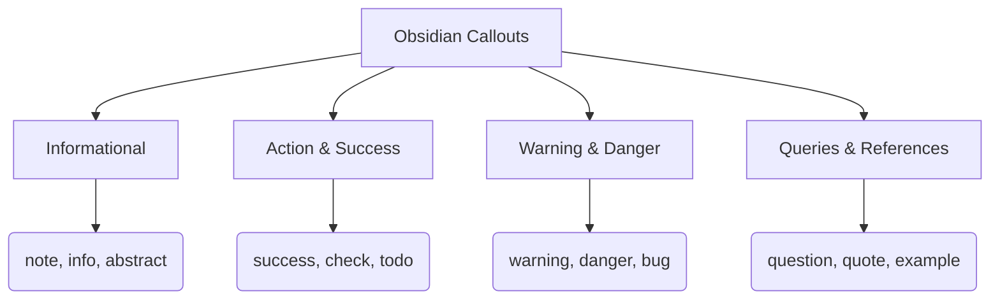

## The Obsidian Callout Ecosystem



Callouts are the primary mechanism for breaking up monolithic walls of text in Obsidian. They leverage the standard Markdown blockquote syntax (`>`) but inject CSS-driven background colors, distinct margins, and SVG icons based on a specific keyword bracketed at the very top. This creates an immediate visual hierarchy within the note.

By categorizing information into distinct visual buckets—like making critical errors red and foundational theories blue—the cognitive load of scanning a dense document is drastically reduced. You are no longer just formatting text; you are designing a user interface for your future self. The parser reads the `[!keyword]`, maps it to a predefined CSS class, and renders the stylized box dynamically.

---

### Native Callout Keywords

Obsidian supports a robust library of native callouts. Any of the keywords below can be placed inside the brackets (e.g., `> [!warning]`) to trigger the corresponding style. 

| Keyword Family | Default Color | Semantic Purpose |
| :--- | :--- | :--- |
| `note`, `info` | Blue | General context, neutral data points, or standard definitions. |
| `abstract`, `summary` | Teal | TL;DR sections or high-level overviews at the top of notes. |
| `success`, `check` | Green | Completed tasks, verified facts, or positive outcomes. |
| `warning`, `caution` | Orange | Potential pitfalls, edge cases, or best practices to watch out for. |
| `danger`, `error`, `bug`| Red | Critical failures, irreversible actions, or broken logic. |
| `question`, `help`, `faq`| Purple | Open loops, prompts for further research, or uncertainties. |
| `example` | Purple | Case studies, code snippets, or practical applications. |
| `quote`, `cite` | Gray | Extracted text from external sources or literature notes. |

---

### Advanced Callout Engineering

**Folding Mechanics (Collapsibility)**
You can turn any callout into an accordion menu by appending a `-` or `+` directly after the closing bracket. 
* Use `> [!info]-` to make the callout **closed** by default. This is highly effective for burying dense reference data, raw code blocks, or answer keys that you only want to see on demand.
* Use `> [!info]+` to make it **open** by default but still collapsible. 

**Title Overrides**
By default, the callout's title matches the capitalized keyword (e.g., `> [!bug]` outputs a box titled "Bug"). You can overwrite this by typing directly after the brackets. 
Example: `> [!bug] The Rendering Issue` replaces the default title with your exact text, while keeping the red color and bug icon.

**Deep Nesting**
Because callouts are built on blockquotes, they can be nested infinitely by stacking the `>` prefix. 
```markdown
> [!note] Parent Container
> This is the main theory.
>> [!example]- Nested Example
>> Here is the hidden practical application.
```

---

### Self-Test: Checking Your Grip

1.  **Syntax:** What is the exact string of characters required to create a red "danger" callout that is folded/closed by default and titled "Critical System Failure"?
2.  **Logic:** Why would you use a `[!quote]` callout instead of a standard Markdown blockquote (`> Text`)?
3.  **Application:** If you are drafting a long technical tutorial, which callout type is best suited for the "TL;DR" at the very beginning of the document?

**Answers:** 1. `> [!danger]- Critical System Failure`; 2. The callout provides a distinct icon, an explicit title bar, and a dedicated background color, whereas a standard blockquote is usually just an indented line with a left border; 3. `[!abstract]` or `[!summary]`.


# Showcase


> [!note] Note
> The baseline callout. Used for standard information, context, or general remarks.

> [!abstract] Abstract (or Summary, TLDR)
> Perfect for high-level overviews or putting a brief summary at the top of a document.

> [!info] Info
> Functionally identical to a note in most themes, highlighting general facts and data.

> [!todo] To-Do
> Highlights actionable items, pending tasks, or next steps in your workflow.

> [!tip] Tip (or Hint, Important)
> Used for best practices, shortcuts, or helpful advice to improve efficiency.

> [!success] Success (or Check, Done)
> Marks a completed task, a verified solution, or a positive, expected outcome.

> [!question] Question (or Help, FAQ)
> Flags uncertainties, open loops, or prompts for further research and review.

> [!warning] Warning (or Caution, Attention)
> Draws attention to potential pitfalls, edge cases, or things to carefully watch out for.

> [!failure] Failure (or Fail, Missing)
> Indicates a negative outcome, a broken process, or missing/incomplete data.

> [!danger] Danger (or Error)
> Reserved for critical system failures, data loss risks, or irreversible actions.

> [!bug] Bug
> Specifically highlights software glitches, coding errors, or unexpected system behavior.

> [!example] Example
> Used for case studies, syntax demonstrations, or practical applications of a theory.

> [!quote] Quote (or Cite)
> Extracts text from external sources, literature notes, or exact audio transcripts.