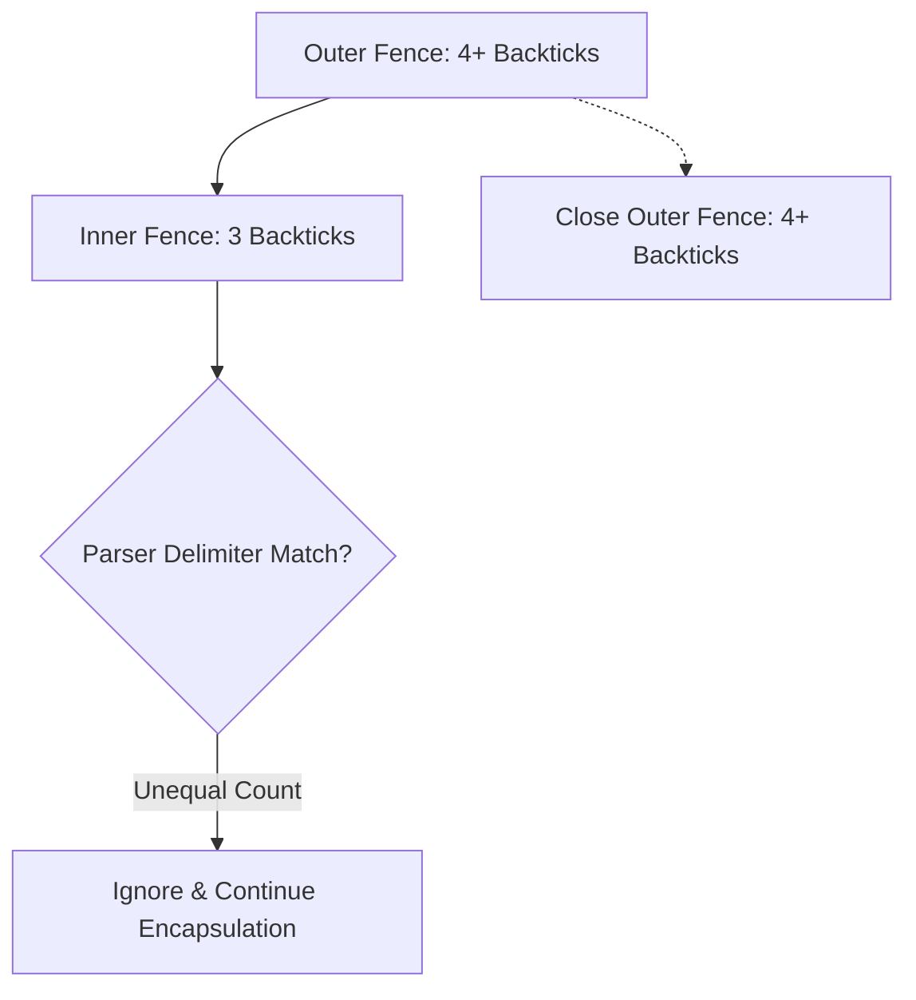

## The N+1 Fencing Rule for AI Prompts



Markdown parsers execute strict, "greedy" termination. They close a fenced block the microsecond they hit a sequence of backticks that exactly matches the opening sequence. If an AI generates a master wrapper using three backticks and puts a three-backtick Mermaid diagram inside it, the parser assumes the Mermaid's closing tag is actually the master wrapper's closing tag. The container shatters, and everything below it leaks as raw text.

To prevent an LLM from breaking structural bounds, you must hardcode the syntax logic into its system prompt. The rule is simple: the parent container must mathematically outrank the child elements. By using an "N+1" backtick count for the outer wrapper, you force the parser to treat all standard three-backtick inner blocks as harmless string data rather than termination commands.

> [!tip] The Dense Chatbot Instruction
> **Copy/Paste this exact block into your system prompt or custom instructions:**
> "CRITICAL: When encapsulating your entire response in a master Markdown block, you MUST use an N+1 delimiter (e.g., 4 backticks: ` ````markdown `) if the response contains nested 3-backtick blocks like Mermaid diagrams. Parsers terminate blocks at the first matching delimiter; utilizing 4+ backticks prevents inner blocks from prematurely shattering the master container."

### Delimiter Precedence Matrix

| Internal Content | Max Inner Backticks | Required Master Fence | Parser Outcome |
| :--- | :--- | :--- | :--- |
| Standard Text | 0 | ` ``` ` (3) | Safe encapsulation. |
| Inline Code | 1 | ` ``` ` (3) | Safe encapsulation. |
| Mermaid / Python | 3 | ` ```` ` (4) | Prevents premature 3-tick termination. |
| Custom Script Block | 4 | ` ````` ` (5) | N+1 rule scales infinitely. |

### Self-Test: Checking Your Grip

1.  **Mechanism:** Exactly why does an inner Mermaid block break an outer code wrapper if both use three backticks?
2.  **Rule Design:** What does "N+1" mean in the context of Markdown fencing?
3.  **Edge Case:** If an AI is generating documentation that explicitly demonstrates how to write a 4-backtick block, what must the AI use to wrap the entire final output?

**Answers:** 1. Parsers terminate at the first identical delimiter match; 2. The outer fence must have at least one more backtick than the largest nested block; 3. Five backticks (` ````` `).
