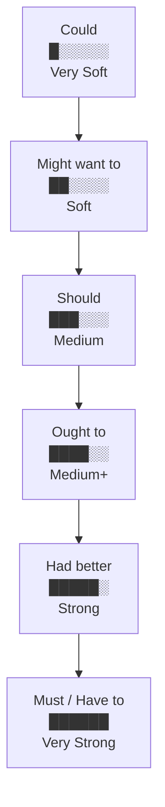

Categorization modal: Intensity of the suggestions

```mermaid
flowchart TD

    A["Could<br/>█░░░░░<br/>Very Soft"]
    B["Might want to<br/>██░░░░<br/>Soft"]
    C["Should<br/>███░░░<br/>Medium"]
    D["Ought to<br/>████░░<br/>Medium+"]
    E["Had better<br/>█████░<br/>Strong"]
    F["Must / Have to<br/>██████<br/>Very Strong"]

    A --> B
    B --> C
    C --> D
    D --> E
    E --> F
```