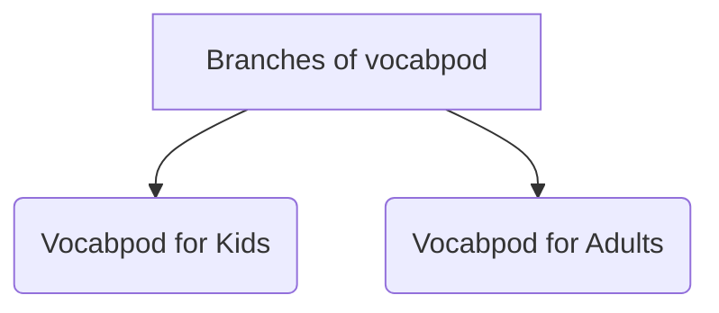
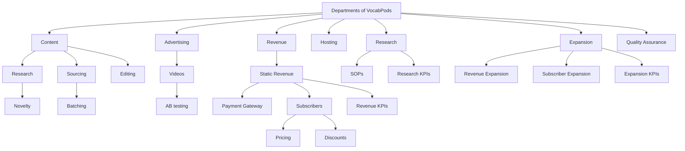

Branches:

```mermaid
flowchart TD
A[Branches of vocabpod] --> B(Vocabpod for Kids)
A --> C(Vocabpod for Adults)
```

Departments:

```mermaid
flowchart TD
A[Departments of VocabPods] --> B[Content]
	B --> G[Research] --> H[Novelty]
	B --> I[Sourcing]
		I --> bat[Batching]
	B --> J[Editing]
A --> C[Advertising] 
	C --> vid[Videos]
	vid --> ab[AB testing]
A --> revenue[Revenue]
	revenue --> D[Static Revenue]
		D --> gat[Payment Gateway]
		D --> subs[Subscribers]
			subs --> pri[Pricing]
			subs --> dis[Discounts]
	D --> revkpi[Revenue KPIs]
A --> hos[Hosting]
A --> E[Research]
	E --> sop[SOPs]
	E --> reskpi[Research KPIs]
A --> F[Expansion]
	F --> revexp[Revenue Expansion]
	F --> subexp[Subscriber Expansion]
	F --> expkpi[Expansion KPIs]
A --> qa[Quality Assurance]
```
